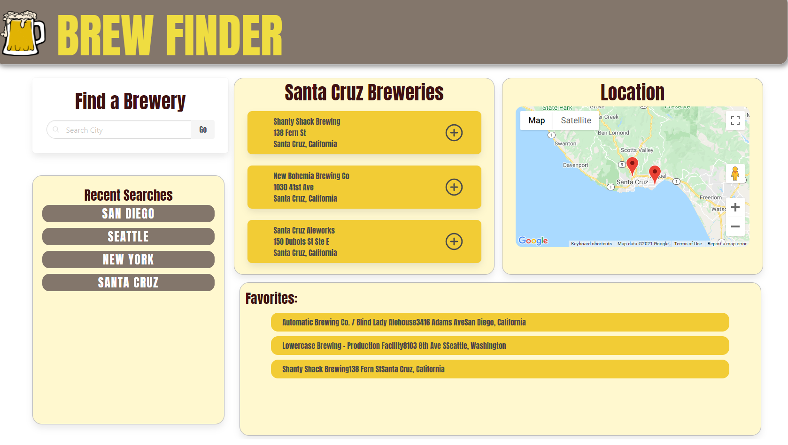

# Brew-Finder
Brew Finder is an application that allows you to search for a brewery by city. A short description and a location finder provides you with additional information about the brewery. 

## Languages/ Resources Used:
* HTML
* JS
* CSS
* Open Brewer DB API
* Bulma
* Google Maps API (access will not be upkept)

## User Story
* As a social butterfly.
* I want to search for a brewery location.
* So that I can visit this location.

## Acceptance Criteria

* Given a brewery finder with form inputs 
* When I search for a city
* Then I am presented with multiple brewery locations
* When I search a different city 
* Then I am presented with a recent search history
* When I view the brewery location
* Then I am presented with the city name and brewery address 
* When I select the brewery 
* Then I am able to add it to the favorites tab
* When I view the address 
* Then I am presented with a Map with marker locations

## Authors 
Adam Secord, Ajia Holiday, Brooke Thorson, Duncan Herington, Kendra Staver, & Reyna Ortiz

## Link 

https://asecord92.github.io/brew-finder/

## Link to original repository
https://github.com/asecord92/brew-finder
